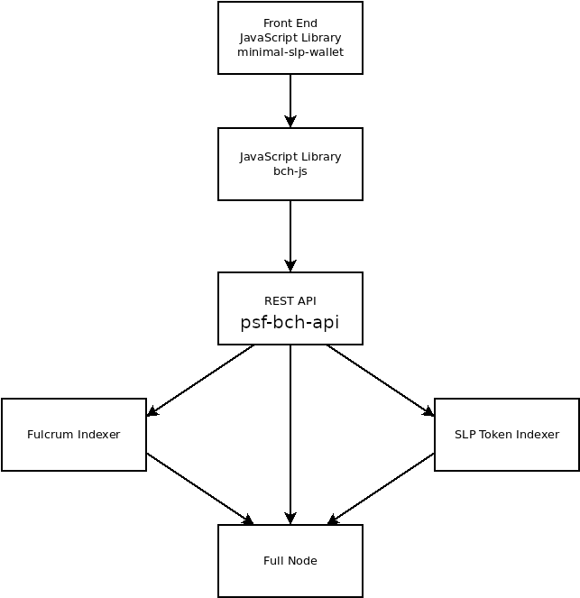

# psf-bch-api

[](https://github.com/Permissionless-Software-Foundation/psf-bch-api/blob/master/LICENSE.md)
[](https://github.com/feross/standard)

This is a REST API server for communicating with Bitcoin Cash (BCH) blockchain infrastructure. It is written in node.js JavaScript using the [Express.js](https://expressjs.com/) framework and follows the [Clean Architecture](https://blog.cleancoder.com/uncle-bob/2012/08/13/the-clean-architecture.html) design pattern. It replaces the legacy [bch-api](https://github.com/Permissionless-Software-Foundation/bch-api) and implements the [x402-bch protocol](https://github.com/x402-bch/x402-bch) for optional per-call payments.

psf-bch-api is the heart of the [Cash Stack](https://cashstack.info), a full software stack for building blockchain-based applications. It creates a single web2 REST API interface that abstracts away the complexity of the underlying blockchain infrastructure, so that application developers can interact with the blockchain through simple HTTP calls.



psf-bch-api depends on three pieces of back end infrastructure:

- **[BCHN Full Node](https://cashstack.info/docs/back-end/bchn-full-node)** - the base blockchain node that validates transactions and blocks.
- **[Fulcrum Indexer](https://cashstack.info/docs/back-end/fulcrum-indexer)** - an address indexer that tracks balances, transaction histories, and UTXOs.
- **[SLP Token Indexer](https://cashstack.info/docs/back-end/slp-indexer/slp-indexer-software)** - tracks all SLP tokens on the blockchain.

Front-end applications interact with psf-bch-api through libraries such as [bch-js](https://github.com/Permissionless-Software-Foundation/bch-js) or [bch-consumer](https://www.npmjs.com/package/bch-consumer).

High-level documentation about the full Cash Stack is available at [CashStack.info](https://cashstack.info). Interactive API reference documentation is served by the running server at its root URL (e.g. `http://localhost:5942/`), and a live version can be found at [bch.fullstack.cash](https://bch.fullstack.cash/).

## The .env File

All runtime configuration is driven by a `.env` file in the project root. An example is provided at `.env-example`. To get started:

`cp .env-example .env`

Then edit `.env` to match your environment. The file is organized into two sections:

### Infrastructure Setup

These variables tell psf-bch-api where to find the back end services it depends on:

- `RPC_BASEURL` - URL of the BCHN full node JSON-RPC interface. Default: `http://127.0.0.1:8332`
- `RPC_USERNAME` - RPC username for the full node.
- `RPC_PASSWORD` - RPC password for the full node.
- `FULCRUM_API` - URL of the Fulcrum indexer REST API.
- `SLP_INDEXER_API` - URL of the SLP Token Indexer REST API.
- `LOCAL_RESTURL` - The REST API URL used internally for wallet operations. Default: `http://127.0.0.1:5942/v6/`

### Access Control Settings

These variables control who can access the API and how they pay for it. The three access-control use cases are described in detail in the [Access Control](#access-control) section below.

- `PORT` - Port the server listens on. Default: `5942`
- `X402_ENABLED` - Enable x402-bch per-call payment middleware. Default: `true`
- `SERVER_BCH_ADDRESS` - BCH address that receives x402 payments. Default: `bitcoincash:qqsrke9lh257tqen99dkyy2emh4uty0vky9y0z0lsr`
- `FACILITATOR_URL` - URL of the x402-bch facilitator service. Default: `http://localhost:4345/facilitator`
- `X402_PRICE_SAT` - Price in satoshis charged per API call via x402. Default: `200`
- `USE_BASIC_AUTH` - Enable Bearer token authentication middleware. Default: `false`
- `BASIC_AUTH_TOKEN` - The expected Bearer token value.

## Access Control

psf-bch-api supports three major access-control configurations. Which one you choose depends on your deployment scenario. The behavior is controlled entirely by the `X402_ENABLED` and `USE_BASIC_AUTH` environment variables.

### 1. No Rate Limits (Open Access)

Set both access-control flags to `false`:

```
X402_ENABLED=false
USE_BASIC_AUTH=false
```

All API endpoints are publicly accessible without any authentication or payment. This is the simplest configuration, ideal for **local development** or **private, trusted networks** where access control is handled at the network level (e.g. behind a firewall or VPN).

### 2. Bearer Token Authentication

Set `USE_BASIC_AUTH=true` and `X402_ENABLED=false`:

```
X402_ENABLED=false
USE_BASIC_AUTH=true
BASIC_AUTH_TOKEN=my-secret-token
```

Every API request (except `/health` and `/`) must include an `Authorization` header with a valid Bearer token:

```
Authorization: Bearer my-secret-token
```

Requests without a valid token receive an HTTP `401 Unauthorized` response. This is the best option when you want to **restrict access to a known set of users or services** (e.g. an organization's internal apps) without requiring cryptocurrency payments.

### 3. x402-bch Per-Call Payments

Set `X402_ENABLED=true`:

```
X402_ENABLED=true
SERVER_BCH_ADDRESS=bitcoincash:qqlrzp23w08434twmvr4fxw672whkjy0py26r63g3d
FACILITATOR_URL=http://localhost:4345/facilitator
X402_PRICE_SAT=200
```

Every API call under the `/v6` prefix requires a BCH micro-payment. When a request arrives without a valid `X-PAYMENT` header, the server responds with HTTP `402 Payment Required` and includes the payment details. Client libraries that support the x402-bch protocol (like [bch-js](https://github.com/Permissionless-Software-Foundation/bch-js)) can handle payments automatically.

This is the right choice for **public, monetized APIs** where you want to charge per call.

#### Combined: x402 + Bearer Token

You can enable both at the same time:

```
X402_ENABLED=true
USE_BASIC_AUTH=true
BASIC_AUTH_TOKEN=my-secret-token
```

In this mode, requests that present a valid Bearer token bypass the x402 payment requirement. All other requests must pay. This allows you to give **free access to trusted clients** (via the Bearer token) while still **monetizing public access** via x402.

## Development

This is a standard node.js project. To set up a development environment:

1. Clone the repository:

`git clone https://github.com/Permissionless-Software-Foundation/psf-bch-api && cd psf-bch-api`

2. Install dependencies:

`npm install`

3. Create your configuration file:

`cp .env-example .env`

4. Edit `.env` to point to your back end infrastructure (full node, Fulcrum, SLP indexer). For local development you will likely want to disable access control:

```
X402_ENABLED=false
USE_BASIC_AUTH=false
```

5. Start the server:

`npm start`

The server will start on port `5942` by default (or whatever you set in `PORT`). API documentation is available at `http://localhost:5942/`.

### Generating API Docs

The API reference documentation is generated by [apiDoc](https://apidocjs.com/) from inline annotations in the source code. To regenerate:

`npm run docs`

The output is written to the `docs/` directory and served by the running server at its root URL.

A live version can be found at [bch.fullstack.cash](https://bch.fullstack.cash/).

## Production (Docker)

A Docker setup is provided in the `production/docker/` directory for production deployments. The target OS is Ubuntu Linux.

1. Install [Docker and Docker Compose](https://docs.docker.com/engine/install/ubuntu/).

2. Navigate to the Docker directory:

`cd production/docker`

3. Create and configure the `.env` file. An example is provided:

`cp .env-example .env`

Edit `.env` to match your production infrastructure. Note that inside a Docker container, `localhost` refers to the container itself. Use `172.17.0.1` (the default Docker bridge gateway) to reach services running on the host machine:

```
RPC_BASEURL=http://172.17.0.1:8332
FULCRUM_API=http://172.17.0.1:3001/v1
SLP_INDEXER_API=http://172.17.0.1:5010
```

4. Build the Docker image:

`docker-compose build --no-cache`

5. Start the container:

`docker-compose up -d`

The container maps host port `5942` to container port `5942`. The `.env` file is mounted into the container as a volume, so you can update configuration without rebuilding.

To view logs:

`docker logs -f psf-bch-api`

To stop the container:

`docker-compose down`

A helper script `cleanup-images.sh` is provided to remove dangling Docker images after rebuilds.

## Testing

The project includes both unit tests and integration tests. Tests use [Mocha](https://mochajs.org/) as the test runner, [Chai](https://www.chaijs.com/) for assertions, and [Sinon](https://sinonjs.org/) for mocking. Code coverage is provided by [c8](https://github.com/bcoe/c8).

### Unit Tests

Unit tests are located in `test/unit/` and cover adapters, controllers, and use cases. They do not require any running infrastructure. To run:

`npm test`

This will first lint the code with [Standard](https://standardjs.com/), then execute all unit tests with code coverage.

To generate an HTML coverage report:

`npm run coverage`

The report is written to the `coverage/` directory.

### Integration Tests

Integration tests are located in `test/integration/` and require the back end infrastructure (full node, Fulcrum, SLP indexer) to be running. To run:

`npm run test:integration`

Integration tests have a 25-second timeout per test to accommodate network calls.

## Configuration Reference

All configuration values are read from environment variables (via the `.env` file). The complete list:

- `PORT` - Server listen port. Default: `5942`
- `NODE_ENV` - Environment (`development` or `production`). Default: `development`
- `API_PREFIX` - URL prefix for all REST endpoints. Default: `/v6`
- `LOG_LEVEL` - Winston logging level. Default: `info`
- `RPC_BASEURL` - Full node JSON-RPC URL. Default: `http://127.0.0.1:8332`
- `RPC_USERNAME` - Full node RPC username.
- `RPC_PASSWORD` - Full node RPC password.
- `RPC_TIMEOUT_MS` - Full node RPC request timeout in ms. Default: `15000`
- `FULCRUM_API` - Fulcrum indexer REST API URL.
- `FULCRUM_TIMEOUT_MS` - Fulcrum API request timeout in ms. Default: `15000`
- `SLP_INDEXER_API` - SLP Token Indexer REST API URL.
- `SLP_INDEXER_TIMEOUT_MS` - SLP Indexer API request timeout in ms. Default: `15000`
- `LOCAL_RESTURL` - Internal REST URL for wallet operations. Default: `http://127.0.0.1:5942/v6/`
- `IPFS_GATEWAY` - IPFS gateway hostname. Default: `p2wdb-gateway-678.fullstack.cash`
- `X402_ENABLED` - Enable x402-bch payment middleware. Default: `true`
- `SERVER_BCH_ADDRESS` - BCH address for x402 payments. Default: `bitcoincash:qqsrke9lh257tqen99dkyy2emh4uty0vky9y0z0lsr`
- `FACILITATOR_URL` - x402-bch facilitator service URL. Default: `http://localhost:4345/facilitator`
- `X402_PRICE_SAT` - Satoshis charged per API call via x402. Default: `200`
- `USE_BASIC_AUTH` - Enable Bearer token authentication. Default: `false`
- `BASIC_AUTH_TOKEN` - Expected Bearer token value.

## License

[MIT](./LICENSE.md)
